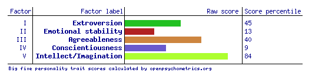

# Introduction to Information to Technology

# Assignment 1: My Profile

## Personal Information

**Name:** Benjamin Gough

**Student Number:** S3729107

**Email Address:** s3729107@student.rmit.edu.au

**Nationality:** Australian

**Education:** Completed HSC, studied a Bachelor of Communication (Sound and Music Design) for one year

**Languages Spoken:** English

**Hobbies:** Producing music, gaming, going to music events

**Interesting Fact:** Half of my family lives in Italy

## Interest in IT

### What is your interest in IT? When did your interest in IT start? Outline your IT experience (if any)
I have always been interested in new and exciting technology, and watching the development of these things change the way we do things on our day to day life. I am also a big fan of video games, and have been interested in games development since a young age. I started out using programs such as GameMaker to develop simple 2D games, always developing my skills. For my major work for the year 12 subject Multimedia, I used GameMaker to create a much more complex and cohesive game than I had in the past. It was a 2d side scrolling puzzle based game, with heavy influence in artstyle from the game Limbo. It was selected for InTech, a yearly showcase of the most successful technical major works. Since then I have been teaching myself JavaScript and Java to develop these skills further.

### Why did you choose to come to RMIT?
I chose to come to RMIT because I believe the university will provide me with the necessary facilities and knowledge to develop my expertise and begin a promising career in the area. I had heard great things about the facilities and quality of the technical programs that it offers via word of mouth of people I trust. From that point, I liked the sound of the course / subject outlines that I read through for the course.

### What do you expect to learn during your studies? 
I hope to develop the skills needed to kick start a career in games development or front-end programming. I also hope to develop skills needed to build an expansive portfolio in a variety of different practices and programming languages. 

## Ideal Job
[Link to Job](https://www.seek.com.au/job/36927758?type=standard)

### Job Description
The job is to be a junior front-end developer for a digital agency. You would be working under senior and mid level front-end developers, and receive tasks from them. You would work with creative and digital teams to convert ideas into presented visual material using a variety of methods.

This job appeals to me because I am very interested in front end development. I’ve always been passionate about design, and love the juncture between it and programming. I have used JavaScript and a library called p5.js to create interactive visual projects, and have really enjoyed this.

### Skills & Experience Needed:
- At least one year’s work experience with an advertising or digital agency.
- Good understanding of current web technology and trends in digital development, and best current practices.
- Intermediate level in the following programs / methods:
-- **Adobe Photoshop**
-- **Adobe Illustrator**
-- **Adobe InDesign**
-- Typography
-- Adobe Edge
-- HTML5
-- 3rd Party Platform Double Click Studio
-- 3rd Party Platform Sizmek
-- Google Web Designer
-- Adobe Dreamweaver
-- HTML
-- CSS
-- XML
-- **JavaScript**
-- Adobe After Effects

I have highlighted the components which I currently consider myself having sufficient knowledge in. I have skills that would help in general with the position and job environment, such as good interpersonal and communication skills developed through various customer service and sales positions. I also have a great eye for detail which I imagine would help in this kind of role.

I can use youtube tutorial videos, or attend short courses to become acquainted with the rest of the methods. During my bachelor degree here at RMIT I imagine that I will be learning languages such as HTML and CSS. I will also gain knowledge of current web technologies and current practices throughout the degree.

To get a year’s experience within an advertising or digital agency, I can pursue an internship while studying so that I could apply for this job as soon as i finish my degree.

I would draft a portfolio of my past work to express my literacy in the variety of areas that are required.

## Personal Profile

### Myers-Briggs Results

These results were from the website _https://mbti.bz/en_. Since I place between 50% - 54% in Sensation/Intuition and Feeling/Thinking my personality type could be undetermined, but this website categorised me as ISFP. On the website _16personalities_ - which offers a test based on the Myers-Briggs categories - I received 78% intuition which would put me between INTP and INFP. Reading through the types’ explanations, I definitely feel like I relate very strongly with the INTP personality type above the others.

### Learning Style Test

According to the learning style test available on the website _how-to-study_, I am a Visual learner. This was interesting to me, as I have always thought that I am more of a Tactile/Kinesthetic learner, since I like to test things through a practical approach to learn.

### Big Five Personality Test

This test seems to reflect my results from the Myers-Briggs test fairly accurately. The coloured bars represent my level of the particular factor, and the numbers on the right hand side represent the percentage of people who i score higher than in that factor. Seeing as conscientiousness represents organisation and diligence, I’m pretty surprised that so many people score so much higher than me, when I received almost middle range.

### Analysis
These results generally mean that I would be pretty cooperative in a team, happy to go along with anything as long as its cohesive. When it comes down to it I do prefer working alone over working in a team, which is reflected by my introversion levels in these tests. However, I’m still happy to play the part of mediator in a team, often seeing the middle ground which is shown by my mid-ranged results in the Myers-Briggs categories. Still though, I do have ideas and input that can be unique and outside of the box, so team members that are somewhat open minded would be preferred.

## Project Ideas

### Overview
My idea for a project is a cooperative multiplayer 2d side scrolling platformer game, which would draw heavy influence from the roguelike genre. Players would be able to party up in teams of four at a maximum, and each choose a class. These classes would have unique abilities that would unlock and develop through leveling up while progressing through the game. The game would be structured with a series of dungeons that get harder as the players progress and their characters become stronger. Players would use teamwork and strategy to implement their unique abilities in a cohesive way to surpass the obstacles and challenges of the different enemies.

### Motivation
While the roguelike genre is very popular and widely spanning, I believe this project would be interesting and quite unique as there are no prevalent multiplayer games of this kind. The roguelike genre get players hooked using the permadeath mechanic, which frustrates and motivates users to play their best. Games with freedom of character choice are also very popular, and I believe the combination of these two facts would make the project quite successful. 

### Description
Players - in their parties of up to four - would start each run by choosing their class. The game’s classes would be structured in damage-focused classes, defense-focused classes and supporting classes. The damage classes would include: an archer class, a rogue class, a mage class, necromancer class. The defense classes would include: a knight class, a golem class, a warrior-smith class. The support classes would include: a healer class, a relic-wielder class and a beast-tamer class. Unique strategies and combinations would develop over time through selecting these characters. 

In game, the permanent death mechanic of most roguelike games will exist, but adjusted to make sense with the multiplayer compatibility. When one player dies, they will turn into a ghost, and their teammates will have the opportunity to resurrect them using a unique item or crippling ability. These methods of resurrection will be difficult to enact in situations with heavy enemies. As a ghost, the player will be able to execute very basic actions to assist their team. If all players of a team turn into ghosts by dying, that will mean game over and the end of the run. Experience earned by each player throughout that run will be converted to “Class Prestige Experience”, which will boost that player’s class’s stats on their future runs, helping the player to reach where they were up to a little bit.

The game is side scrolling, and in this instance players will use the WASD keys to move, and the spacebar to jump, to give them the freedom to use the mouse to direct abilities. Characters’ abilities are class specific and slightly randomised on each run. Left click will be a generic normal attack, while right click will be a slightly stronger version. The Q and E keys will be reserved for abilities. 

Players will progress through the world by challenging a series of randomly generated dungeons with progressing difficulties. As players defeat enemies they will earn experience to level up their abilities, and gold to buy items and equipment. Bosses will appear at the end and maybe half way through each dungeon, challenging players with complex mechanics and ability progressions. Between each dungeon players have the chance to visit towns to stock up on supplies and upgrade their gear, navigating through the world via teleport locations on the world map.

The graphics of the game will be 2D and in a simplistic cartoon style help the players distinguish between enemy attacks that they must avoid, and their own. In a 2D game it is easy to overcomplicate the visuals to the point where it is too complicated and messy, and makes it very difficult for the player to avoid attacks. This is why this game would feature cooler colours for friendly attacks and abilities, while enemy attacks would all be in hotter colours. Additionally, focus would be given to enemy attacks over those made by team mates, to further discourage overcrowding. Later on in the game where enemies will be abundant and characters’ abilities will be increasingly complicated / larger visually, this will be especially important. Characters will also be easily distinguishable from each other, and a player will always have a noticeable outline around their character.

### Skills Required
For this project, a good understanding of the programming language Java would be ideal (my chosen language for the game). This would be used to build the game in its engine, functionality, and networking for multiplayer. Animation and graphic design skills would also be necessary to build the visual aspects of the game, as well as sound and music design skills.

### Tools and Technologies
Any Java IDE (integrated development environment) would suffice for writing the code, but I am most comfortable with Eclipse, which can be found online free of charge. Animation could be done in Adobe Flash, then exported / converted to animation sprite sheets which can be implemented in Java code. Backgrounds and other still images could be designed in Adobe Photoshop. These Adobe programs can be found online via a subscription. The music and sound of the game I would make in Ableton Live (which I already own), using a synth plug-in such as Massive.

### Outcome
If the project is successful, ideally it would be featured on game distribution platform Steam. It would offer a new and exciting entry into the expansive roguelike genre, with multiplayer compatibility that is essentially unique in its core functionality. It would give people a fun and new multiplayer game that can be played casually with a few friends, or more intensely with the goal to surpass their previous attempts. The roguelike genre means that players can join in with their friends regardless of how much time each of them has put into the game. 

## Micro Credential

I have completed the Application Package credential, however have been waiting for my result from the final assessment for a few days.
